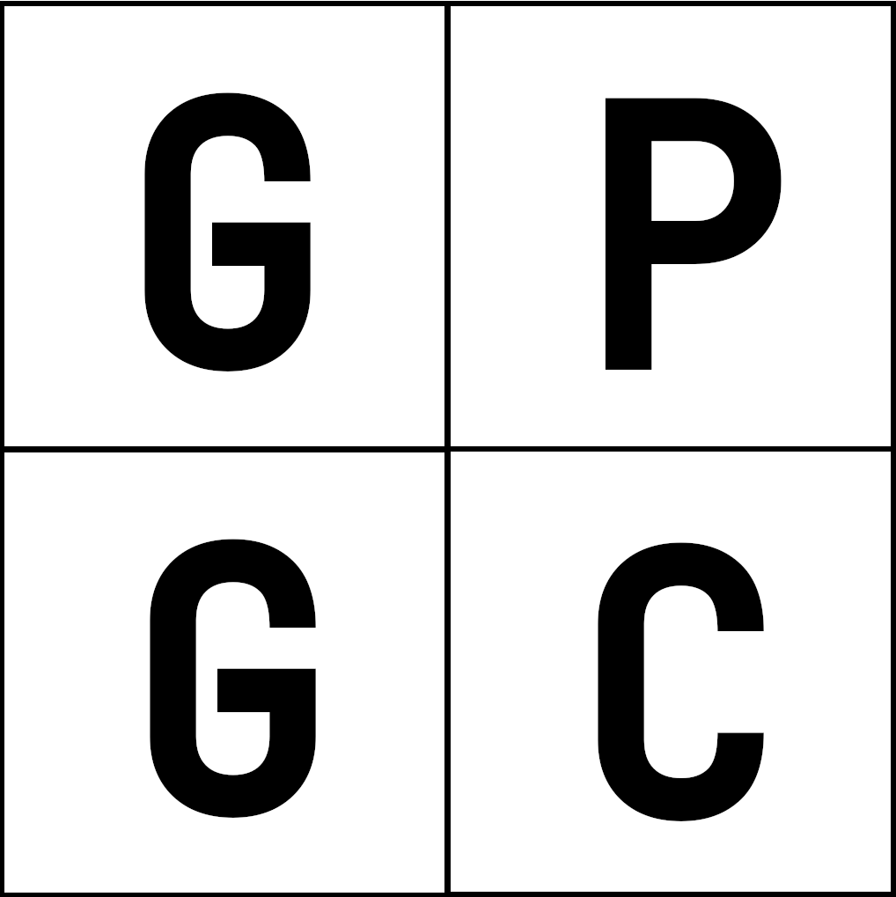

<div align="center">

</div>

# General Purpose Geospatial Compression (GPGC)
The GPGC algorithm is a quad-tree set-partition-coding algorith that is designed to use information entropy as a means to process data. This repository is currently undergoing heavy development, and is awaiting benchmarking and improved utilities.

To clone the respository
```
git clone --recurse-submodules https://github.com/quothbonney/gpgc.git
```
