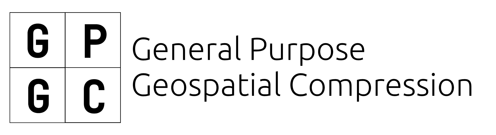
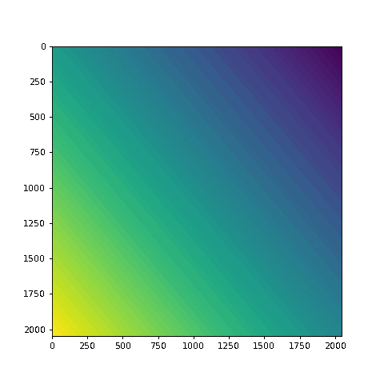

<div align="center">

</div>

## A compression algorithm to *drive* the world
The GPGC algorithm is a novel  quad-tree set-partition-coding algorithm that is designed to use information entropy as a means to analyze data, allowing for smarter encoding. 
It is specialized for rasterized geospatial data in a GeoTIFF or DTED format, facilitating transfer and storage of high precision LIDAR data for uses in automated vehicles, air-ground collision avoidance,
robotics, and precision agriculture.
<div align="center">

</div>

GPGC is a fully open-source binary format that outperforms similar lossy geospatial data compression algorithms in both efficiency and accuracy
- **Mathematically ensured to be artifact-proof.** Geospatial rasters are not like images, where small artifacts and discrepancies can be overlooked. GPGC takes major strides to ensure
the integrity of data by working only with linear transforms and partitioning, as well as setting both manual and automation maximum error thresholds.
- **An efficiency only matched by JPEG.** The codec is able to hold its own with even the most sophisticated and mature codecs such as JPEG and WEBP. At high qualities
they are often almost identical. The only difference? Smart entropy-coding in GPGC allows storage to be diverted to critical areas.
- **Linear complexity decoding** GPGC's novel, stack-based decoder is believed to be the theoretically most efficient depth-first search of a quad tree structure, reconstructing
encoded binary at unbelievable speeds.
- **Controllable Quality** The compression takes in both an expected standard deviation (sigma) of errors and a maximum entropy per pixel (mu). This fine-grained control
allows users to throttle compression ratios based on their own usage.

## Getting Started
### Dependencies
GPGC's C++ implentation currently has three dependencies: Eigen, IEEE754half, and GDAL. The short float header file `half.hpp` is linked as a submodule,
and can be cloned recursively. For the remaining dependencies, they must be installed manually. On Ubuntu this is sample:
```shell
sudo apt install libeigen3-dev
sudo apt-get install libgdal-dev
````
If you are not on an Ubuntu based distribution, I trust you can locate these packages on your own.

Windows and MacOS are currently not supported, but this is working to be fixed soon.

### Building
```shell
git clone --recurse-submodules https://github.com/quothbonney/gpgc.git
mkdir build && cd build
cmake ..
make
```

Now locate the binary in the `cmake-build-debug` directory, if you have not used cmake before and consider the `-h` flag of binary `gpgcconv`

```
Usage: gpgcconv <infile> <outfile>
Examples:
	gpgcconv input.tif output.gpgc [-u Partition Standard Deviation (int)] [-z Partition max entropy (double)] [--verbose] [--no-max-error]
	gpgcconv input.gpgc output.png
```

## Special Acknowledgements
<div align="center">
<span>&nbsp;

</span>
<span>&nbsp;

</span>
<span>&nbsp;

</span>
</div>

